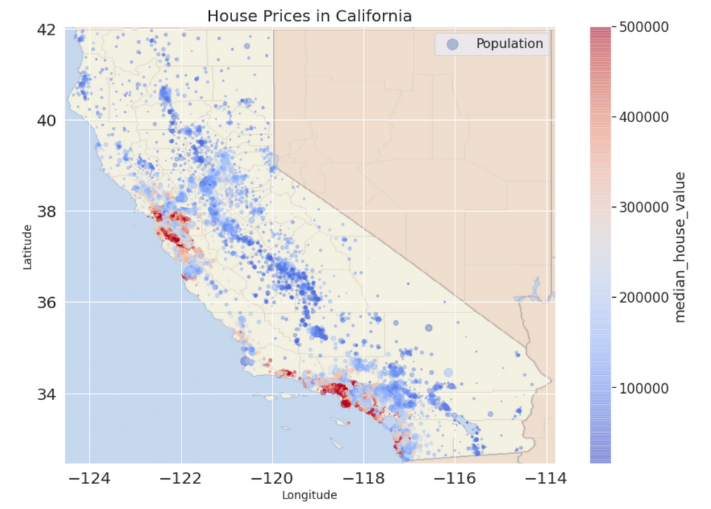

### Housing-Dataset-Preprocessing &amp; Feature Engineering for Machine Learning 
 
  

__Features__:
* **longitude:**  geographic coordinate (district´s east-west position)
* **latitude:**  geographic coordinate (district´s north-south position)
* **housing_median_age:** median age of houses in district
* **total_rooms** Sum of all rooms in district
* **total_bedrooms** Sum of all bedrooms in district
* **population:** total population in district
* **households:** total households in district
* **median_income:** median household income in district 
* **median_house_value:** median house value in district
* **ocean_proximity:** District´s proximity to the ocean

#### Steps followed
**1.** Data Import & first inspection
  

**2.** Data Cleaning

**3.** Creating additional features

**4.** Factors influencing House Prices

**5.** Exploratory Data Analysis

**6.** Feature Engineering

**7.** Splitting the data into Training & Test Set

**8.** Training the ML model (Random Forest Regressor)

**9.** Evaluating the model on the Test Set

**10.** Feature Importance  

